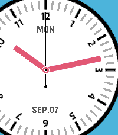

# Glimmer for Pebble (Emery Edition)

  

Glimmer is a dynamic, ultra-battery-efficient analog watchface built exclusively for **Pebble Time 2 (Emery)**. It combines the aesthetic charm of an active analog timepiece with the power efficiency of a digital watch.

---

## ✨ Key Features

- **Catch-up Rolling Animation**: Smoothly catches up to the current time with an optimized fixed-point Cubic Ease-Out animation when waking from standby.
- **Natural 3D Wrist Gestures**: 
  - Turn wrist outward (≥80°) to put the watch to sleep instantly with a brief haptic pulse and dark dial mask.
  - Turn wrist inward (≤60°) or tap the screen to wake up immediately.
- **Capacitive Touchscreen & Tap Support**: Touch or tap the screen anytime for instant wake-up.
- **Extreme Power Efficiency**:
  - **Zero Display Redraws in Standby**: Screen freezes when not in use, cutting display redraws by over 95%.
  - **100% Deep Sleep in Hibernation**: Full MCU deep sleep when resting, delivering 5.5 to 7+ days of battery life.
- **High-Resolution Emery Dial (260×260)**: Custom dial with 12px uniform hands and high-contrast uppercase Day (`MON`) and Date (`SEP.07`) typography.
- **Modern Mobile Settings**: Standalone settings webview with bilingual support (Auto Korean/English), Pebble color palette selector, and customizable gesture angle sliders.

---

## ⚙️ Configuration

Settings page is hosted via GitHub Pages:
`https://andrwj.github.io/pebble-glimmer-watchface/settings.html`

---

## 📄 License

MIT License © A.J (`andrwj`)
